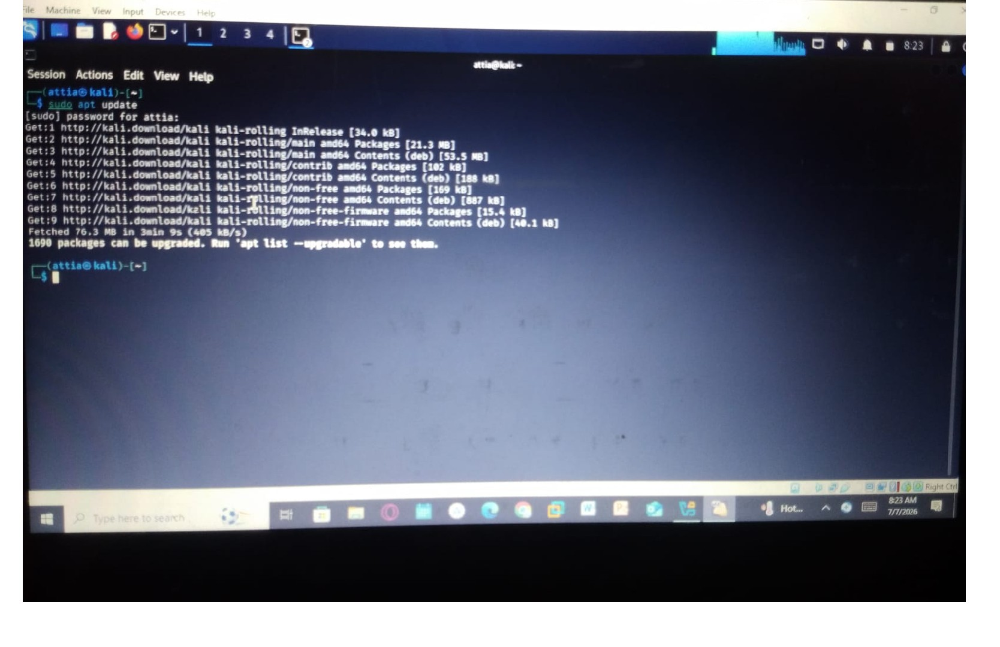
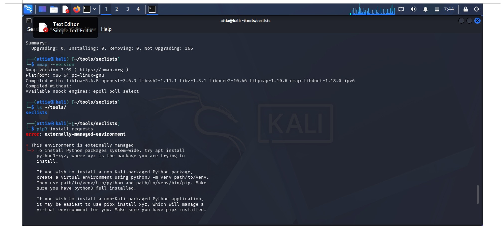
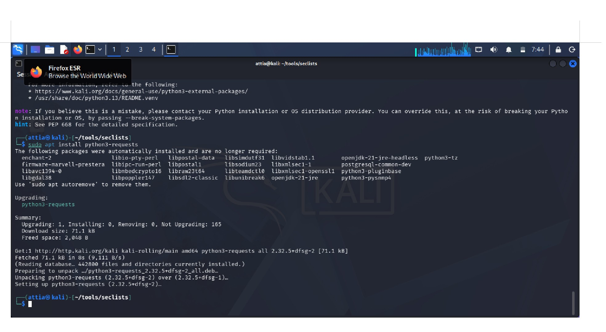
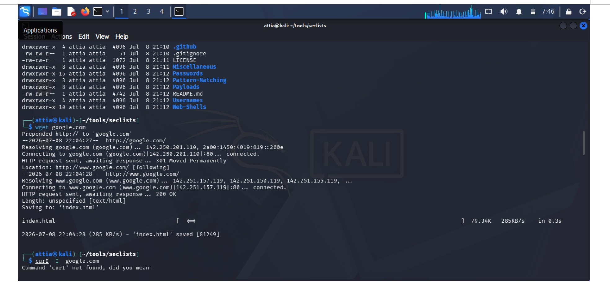
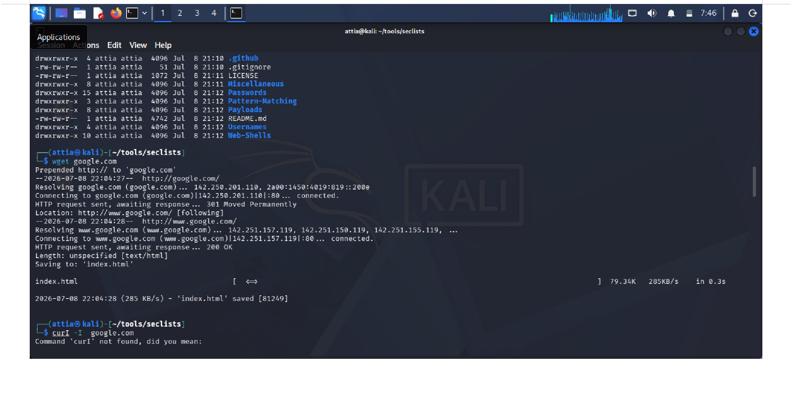
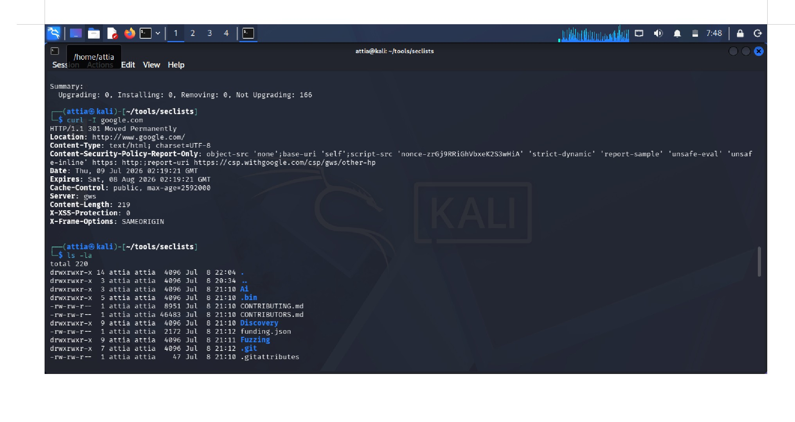
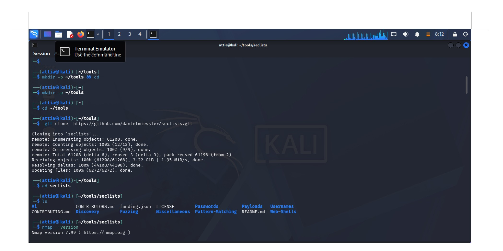
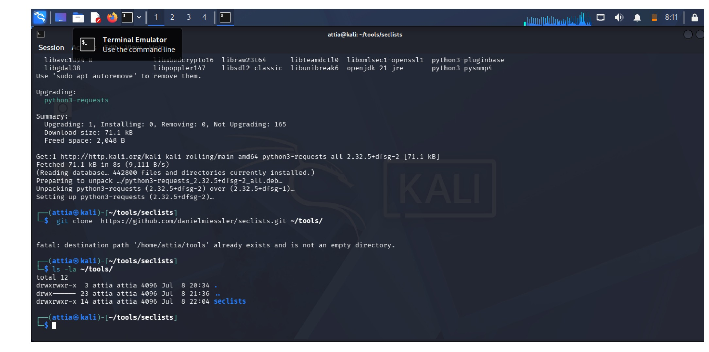
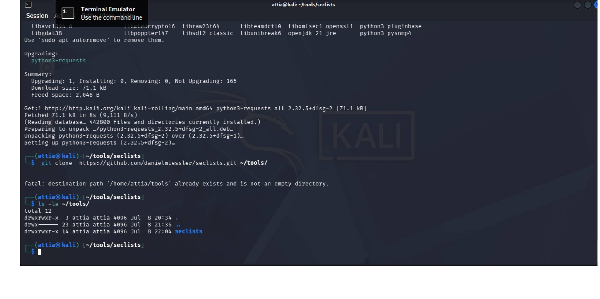
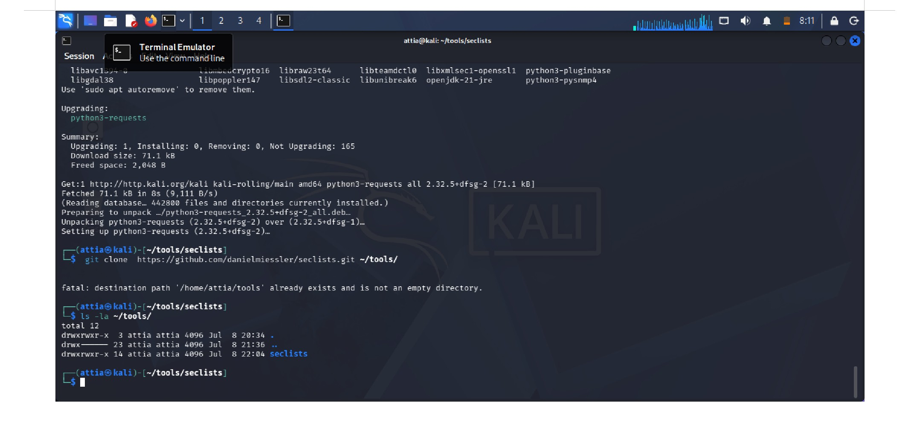

# Kali-Linux-Mini-Project-1

**Instructor:** Sayed Faizan Shah  
**Student:** Attia Rawaid  
**University:** Woman University Swabi  
**Role:** Cybersecurity Intern - Red Team @ Veltrix

## Project Overview
This project covers essential Kali Linux setup for Penetration Testing and Vulnerability Assessment.

## Commands & Steps

### 1. Update Package List
```bash
sudo apt update
```
### 2. Install Security Tools
```bash
sudo apt install -y nmap gobuster hydra wireshark
```
### 3. Verify Nmap Installation
```bash
nmap --version
```
### 4. Install Python Requests Library
```bash
pip3 install requests
```
### 5. Download File using wget
```bash
wget https://example.com/file.zip
```
### 6. Check Website Headers using curl
```bash
curl -I https://example.com
```
### 7. Clone GitHub Repository
```bash
git clone https://github.com/danielmiessler/SecLists.git
```
### 8. List Files in Tools Directory
```bash
ls -la ~/tools
```

## 9. Screenshots
Here are the screenshots of commands executed in Kali Linux:






















